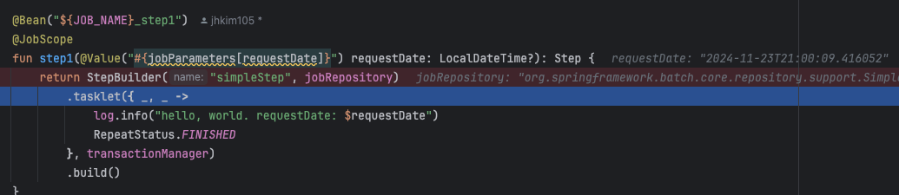

## Batch 기본
### JobParameter 와 Scope
실행시 파라미터를 전달받아 사용할 수 있다. 
- @Value("#{jobParameters[requestDate]}"
- Scope 를 선언해야 한다 (@JobScope, @StepScope)
  * JobParameter의 Late Binding이 가능
- @JobScope 에서는 jobParameters 와 jobExecutionContext 만 사용가능
- spring boot 3 (spring batch 5) 이전 버전에서 JobParameter 타입은 Double, Long, Date, String 만 가능하다.
- 실행시 인자로 전달
  - java -jar spring-batch.jar --job.name=simple-job filename=stock
  
```kotlin
    @Bean("${JOB_NAME}_step1")
    @JobScope
    fun step1(@Value("#{jobParameters[requestDate]}") requestDate: LocalDateTime?): Step {

```


### JobParameter Bean
- Constructor Injection
```kotlin
    @Bean("${JOB_NAME}jobParameter")
    @JobScope
    fun jobParameterExtendJobParameter(
        @Value("#{jobParameters[createdDate]}") createdDate: LocalDate,
        @Value("#{jobParameters[name]}") name: String
    ): JobParameterExtendJobParameter {
        return JobParameterExtendJobParameter(createdDate, name)
    }
```
```kotlin
open class JobParameterExtendJobParameter(
    private val createdDate: LocalDate,
    private val name: String,
) {
    open fun getRequestDate() = createdDate
    open fun getStatus() = name

    override fun toString(): String {
        return "JobParameterExtendJobParameter(createdDate=$createdDate, name='$name')"
    }
}
```

- Setter Injection
```kotlin
    @Bean("${JOB_NAME}jobParameter2")
    @JobScope
    fun jobParameterExtendJobParameter2(
    ): JobParameterExtendJobParameter2 {
        return JobParameterExtendJobParameter2()
    }
```
```kotlin
open class JobParameterExtendJobParameter2{
    @Value("#{jobParameters[createdDate]}") open val createdDate: LocalDate? = null
    @Value("#{jobParameters[name]}") open val name: String? = null
    override fun toString(): String {
        return "JobParameterExtendJobParameter2(createdDate=$createdDate, name='$name')"
    }
}
```

- @Component
```kotlin
@Component
@JobScope
class JobParam(
    @Value("#{jobParameters[createdDate]}") val createdDate: LocalDate,
    @Value("#{jobParameters[name]}") private val name: String,
) {
    override fun toString(): String {
        return "JobParam(createdDate=$createdDate, name='$name')"
    }
}

```

## Job Flow
### BatchStatus VS ExitStatus
- BatchStatus: Batch 실행 결과
- ExitStatus: Step 실행 결과

### JobExecutionDecider 를 통한 분기처리


## Refs
- https://www.baeldung.com/spring-boot-spring-batch
