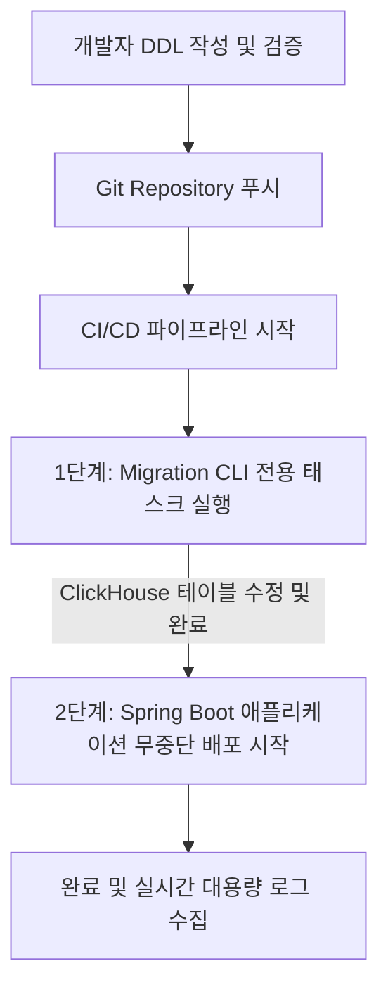

# ClickHouse 스키마 관리 및 배포 전략 가이드

이 문서는 `spring-clickhouse` 프로젝트에서 ClickHouse 데이터베이스의 테이블 스키마 및 데이터를 안정적이고 효율적으로 관리하기 위한 전략과 실무 권장 사항을 정리한 가이드입니다.

---

## 1. 개요 (Introduction)

ClickHouse는 대규모 데이터 분석을 위한 OLAP(온라인 분석 처리) 데이터베이스로, 일반적인 관계형 데이터베이스(RDBMS)와는 다음과 같은 결정적인 차이점이 있습니다:
* **DDL 트랜잭션 미지원:** DDL 실행 중 에러가 발생해도 자동 롤백되지 않습니다.
* **무거운 스키마 수정(Mutation):** 컬럼 변경/삭제 시 디스크의 물리 데이터 블록을 재구성하므로 백그라운드 연산 비용이 크고 지연이 발생할 수 있습니다.
* **복잡한 테이블 엔진 설정:** `ENGINE = MergeTree()`, `ORDER BY`, `PARTITION BY` 등 데이터 분산 및 정렬 구조 정의가 필수적입니다.

따라서 애플리케이션의 엔티티 정의만 보고 자동으로 스키마를 동기화하는 JPA의 `ddl-auto` 같은 방식은 사용이 불가능하며, **명시적이고 격리된 스키마 관리 전략**이 필요합니다.

---

## 2. 현재 프로젝트의 구성: Flyway 방식

현재 `spring-clickhouse` 모듈은 로컬 개발 생산성 및 통합 테스트 자동화를 위해 **Flyway**를 통한 스키마 관리를 채택하고 있습니다.

### 설정 상세
* **의존성:** [build.gradle.kts](file:///Users/jihwankim/dev/my/tutorials-kotlin/clickhouse/spring-clickhouse/build.gradle.kts) 내에 `flyway-core`와 ClickHouse 연동을 위한 `flyway-database-clickhouse` 플러그인을 포함하고 있습니다.
* **환경 설정:** [application.yml](file:///Users/jihwankim/dev/my/tutorials-kotlin/clickhouse/spring-clickhouse/src/main/resources/application.yml)에 아래와 같이 정의되어 있습니다.
  ```yaml
  spring:
    flyway:
      enabled: true
      clean-disabled: false           # 로컬 환경에서 편의성을 위해 clean 허용
      clean-on-validation-error: true  # 스키마 유효성 검증 실패 시 자동 초기화 후 재마이그레이션
  ```
* **마이그레이션 스크립트:** [V1__create_product_view_events_table.sql](file:///Users/jihwankim/dev/my/tutorials-kotlin/clickhouse/spring-clickhouse/src/main/resources/db/migration/V1__create_product_view_events_table.sql)을 통해 테이블 형상을 제어합니다.

### 평가 및 장단점
> [!NOTE]
> **장점:** 복잡한 수동 셋업 없이 코드 복제 및 실행(`bootRun`, `test`)만으로 데이터베이스 환경이 완전 자동 준비되므로 로컬 학습/개발 단계 및 `Testcontainers` 기반 통합 테스트 시 최상의 생산성을 제공합니다.
>
> **단점:** 실무 운영 환경에서 기동 시점에 해당 모드를 활성화하면, 잘못된 스키마 변경 시 롤백 불가능으로 인해 데이터가 손상되거나, 기동 지연 및 `clean` 오작동으로 인한 데이터 전면 삭제 장애가 발생할 위험이 있습니다.

---

## 3. 로컬 개발 환경 개선안: Docker Entrypoint 활용

애플리케이션 구동 시간 단축 및 스키마 반영 작업의 완전한 격리를 원할 경우, **Docker Entrypoint 초기화** 방식을 추천합니다.

### 동작 원리
ClickHouse 공식 도커 이미지는 컨테이너 최초 기동 시 `/docker-entrypoint-initdb.d/` 디렉토리에 마운트된 SQL 스크립트를 자동 순차 실행합니다.

### 구성 단계
1. **마운트 설정 추가**
   [docker-compose.yml](file:///Users/jihwankim/dev/my/tutorials-kotlin/clickhouse/docker-clickhouse/docker-compose.yml) 파일의 `volumes` 항목에 초기화 스크립트 경로를 추가합니다.
   ```yaml
   services:
     clickhouse:
       image: clickhouse/clickhouse-server:24.3-alpine
       volumes:
         - ./init-db:/docker-entrypoint-initdb.d
   ```
2. **초기화 SQL 위치**
   `docker-clickhouse/init-db/01_schema.sql` 경로에 DDL 쿼리를 복사해 둡니다.
3. **애플리케이션 설정 해제**
   애플리케이션 구동 시에는 스키마 마이그레이션을 건너뛰도록 설정을 조정합니다.
   ```yaml
   spring:
     flyway:
       enabled: false
   ```

---

## 4. 실무 및 운영(Production) 환경 권장 전략

실무 서비스 운영 단계에서는 안전성과 성능 보장을 위해 애플리케이션 라이프사이클과 스키마 변경 라이프사이클을 철저하게 **디커플링(Decoupling)**해야 합니다.

### 권장 배포 파이프라인 흐름


### 핵심 실무 수칙

1. **Spring Boot 내장 Flyway 비활성화**
   * 운영 서버 설정 파일(`application-prod.yml`)에서는 항상 `spring.flyway.enabled: false`를 지정합니다.
   * 혹시라도 사용할 경우, 데이터 유실 방지를 위해 `spring.flyway.clean-disabled: true`를 반드시 설정합니다.

2. **외부 Migration CLI 도구 도입**
   * **도구 추천:** `golang-migrate` 또는 `goose`
   * **장점:** 경량 컨테이너 이미지로 빌드하여 배포 파이프라인(Jenkins, GitLab CI, GitHub Actions 등)이나 Kubernetes Job 단계에서 독립적으로 마이그레이션만 선실행할 수 있습니다.
   * **명령어 예시 (`golang-migrate`):**
     ```bash
     migrate -path ./migrations -database "clickhouse://<HOST>:9000?database=default" up
     ```

3. **분산 환경을 위한 `ON CLUSTER` 대응**
   * 실무 클릭스트림 데이터 레이크 구성 시 다중 노드 클러스터를 사용합니다. DDL 스크립트 작성 시 로컬 테이블 생성뿐 아니라 분산 테이블(Distributed Table)과의 매핑 관리가 필요하며, 이는 수동으로 관리되는 DDL 스크립트를 통해서만 오작동 없이 정밀하게 검증/반영될 수 있습니다.
