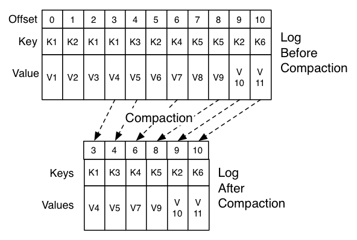

## Log Compaction
- cleanup.policy=compact
- 메시지 전송시 메시지 키를 같이 보내야 한다
- 각 키에 대한 최신값을 유지, 이전 값은 삭제 (log compaction) -> 공간 절약
  - segment 크기나 dirty ration 비율이 정해진 값을 초과하면 clean up 수행
- https://kafka.apache.org/documentation/#compaction
- 

## auto.offset.reset
consumer group 커밋된 offset 이 없는 경우 메시지를 어디서 부터 읽을지에 대한 옵션
offset 이 없는 경우는
- 새로운 consumer group이 처음 실행될 때 (이 그룹으로 커밋된 오프셋이 없음)
- 커밋된 오프셋이 너무 오래되어 로그에서 사라졌을 때 (log retention 기간 지난 경우)

옵션
- earliest:	가장 오래된 오프셋(=토픽의 맨 처음 메시지) 부터 읽기 시작
- latest: 현재 시점 이후에 들어오는 메시지부터 읽기 시작 (기존 메시지는 무시)
- none:	커밋된 오프셋이 없으면 에러 발생 (NoOffsetForPartitionException)

이 옵션은
- auto-offset-reset은 기존에 오프셋이 없을 때만 적용됨
- 새 consumer group으로 테스트하려면 group-id를 바꾸거나 --reset-offsets 수행 필요
- 데이터 재처리(리플레이)가 필요한 경우 earliest가 유용하지만, 실시간 처리용 consumer에서는 latest가 일반적

### reset-offsets 
```sh
kafka-consumer-groups.sh \
  --bootstrap-server localhost:9092 \
  --group <group-name> \
  --topic <topic-name> \
  --reset-offsets \
  --to-earliest \
  --execute
```
web console 에서도 가능


## References
- [Spring Boot Kafka](https://docs.spring.io/spring-boot/docs/current/reference/html/messaging.html#messaging.kafka)
- [Baeldung](https://www.baeldung.com/spring-kafka)
- [Apache Kafka](https://kafka.apache.org/documentation/#gettingStarted) 