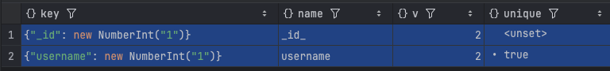

## Index 생성
- application.properties
```properties
spring.data.mongodb.auto-index-creation=true
```
- 확인
```properties
db.users.getIndexes()
```


## Ref
- https://docs.spring.io/spring-data/mongodb/reference/mongodb.html
- https://github.com/spring-projects/spring-data-examples/tree/main/mongodb
- https://www.baeldung.com/queries-in-spring-data-mongodb


